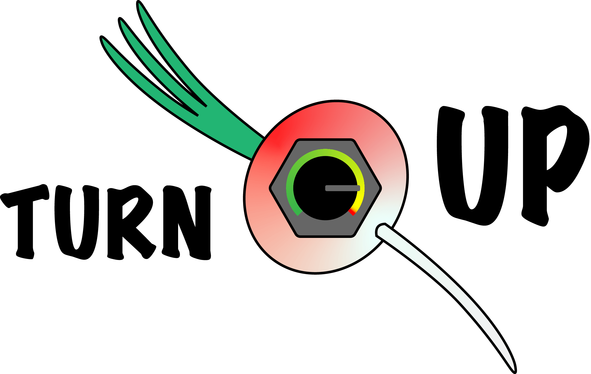

# Turnup - turn yourself up

It's the squares app!

## Vision

- I think the squares are good for motivation
- I like tracking data about myself
- I want to learn some data visualization

So here we are, trying to implent [Pitaya](https://github.com/exr0nprojects/pitaya)'s slicing.

## Features
- [ ] standard object data model, including
    - `start`
    - `duration`
    - `dataset` name
    - `tags`
    - `**kwargs`
- [ ] `data` directory with `config.json` that defines mappings from dataset to standard object model
- [ ] api
    - [ ] web page to display things
    - [ ] perspcetive filter (beware RCE!)
    - [ ] webhook to add arbitrary entries
- [ ] soydev
    - [ ] squares display
    - [ ] summary statistics
        - min, max, mean, median, stddev; for each of {start, end} time of {day, week, month, year}, duration, time since previous
        - charts of the above (possibly rolling)
    - [ ] {daily, weekly, monthly, interval by selecting} breakdown
        - [ ] pie chart for each dataset by {duration}
- [ ] recursive tagging, someday

